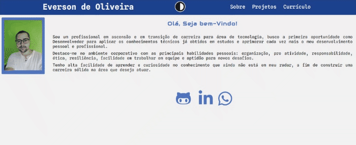

# Meu Portfólio React

Projeto realizado para prática de conceitos com objetivo acadêmico e junto com a apresentação das minhas habilidades técnicas  na área, projeto idealizado por mim.

O objetivo foi construir em React um Portfólio para apresentação das minhas capacidades, as principais cores escolhidas do projeto foram yin que representar o escuro e yang que representar o claro.

<a href="https://project-my-portfolio-eor13.vercel.app/" target="_blank">Clique Aqui para ir direto para página</a>

## Tecnologias utilizadas
- Javascript
- React
- Styled Component
- Vercel

### Conceitos Aplicados de cada Tecnologia
<ol>
    <li>Javascript
        <ul>
            <li>Utilização de Operadores Ternários</li>
            <li>Utilização de Higher Order Functions</li>
            <li>Utilização de Variáveis em diferentes tipos de Escopo</li>
            <li>Utilização do módulos ( import e export ) </li>
        </ul>
    </li>
    <li>React
        <ul>
            <li>Uso do Create React App para criar o projeto </li>
            <li>Utilização de componentes de Função</li>
            <li>Utilização de Elementos de Função</li>
            <li>Utilização de Props</li>
            <li>Utilização de Eventos de "Click e Change"</li>
            <li>Utilização de múltiplos componentes - aninhados</li>
            <li>Utilização de Arrow functions como padrão para estabelecer Funções</li>
            <li>Utilização de Components Stateless e StateFull</li>
            <li>Utilização de Hooks como useState e useEffect</li>
            <li>Renderização de Condicionais</li>
            <li>Utilização de Rotas com ReactRouter</li>
            <li>Atribuição via Desestruturação de Itens</li>
        </ul>
    </li>
    <li>CSS
        <ul>
            <li>Utilização de <strong style="color:green;">Styled Components através do React</strong> para estilização das páginas</li>
        </ul>
    </li>
    <li>Libs e Ferramentas
        <ul>
            <li>Vercel - Utilização de plataforma para exibição página nos navegadores.</li>
            <li>LocalStorage - utilização da ferramenta armazenamento de tema. </li>
        </ul>
    </li>
</ol>